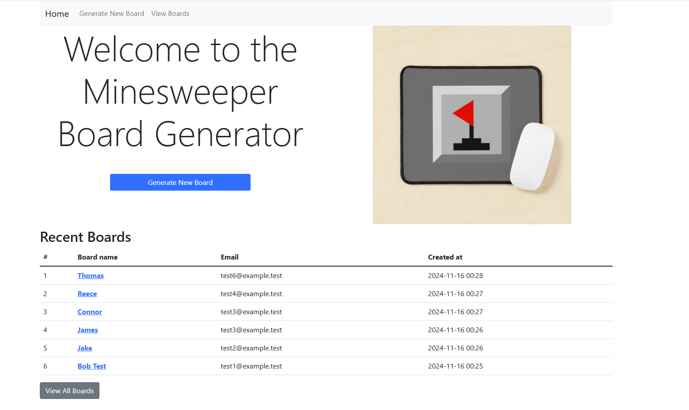

# README

1. Requirement clarification
   - List of require function:
     + Home page
       - Display a list of the ten most recent boards created, with the link to each view
       - Include link to view all generated boards 
     + Board generation
       - Generate a Minesweeper board with custom dimension and a specified number of mines
       - The generated board include some info: email, board name and creation date
     + Board display
        - Display a visual of the generated board, with mines and empty cells represented as specified.
   - UI/UX:
   - Algorithmic Challenge:
     + Implement a Minesweeper board generator algorithm that:
       - Places a given number of mines randomly on the board.
       - Returns a two-dimensional array representing the board’s state before gameplay.
     + Ensure performance scalability for various board dimensions.
   - Handle data:
     + Store generated boards in the database.
2. Solution
    + Backend: 
      - Ruby on rails (rails 7)
      - PostgresQL as the database and Heroku compatibility
    + Frontend 
        - Use Bootstrap to structure views and ensure a responsive design
3. Deployment 
   + Setup github repository
   + setup app deploy on Heroku [deploy_to_heroku.sh](deploy_to_heroku.sh)
4. Enhancement
   + Add more feature, with pagination: ADDED
   + Add function delete generated board
5. Improvement
   + Search and filter
   + Export feature: Allow user export the board via CSV or PDF file
   + Improve UI with the animations tooltips to improve user experience
   + Board interaction: Allow users to interact with the board
   + Test coverage: add the test library and write the test cases to cover the cores feature